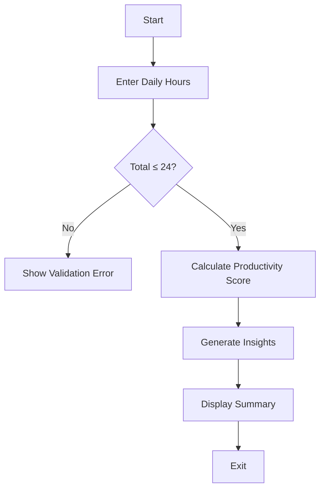

<div align="center">

# ⏳ Daily Routine Analyser

### *A lightweight C program to reflect on your daily habits.*

<p>
Built during a hackathon • Revived with GitHub Copilot • Refactored for cleaner code
</p>

[]


</div>

---

# 📖 Introduction

Daily Routine Analyser is a command-line application that helps users understand how they spend their 24-hour day.

By entering the number of hours spent on studying, sleeping, exercising, and leisure activities, the program validates the schedule, calculates a productivity score, and provides simple suggestions for maintaining a healthier daily routine.

Originally developed during a hackathon, the project was later revisited and refactored using GitHub Copilot to improve readability, modularity, and maintainability.

---

# 🚀 Capabilities

```
✓ Daily routine tracking
✓ Input validation
✓ Productivity scoring
✓ Habit analysis
✓ ANSI colored output
✓ Modular C implementation
✓ Copilot-assisted refactoring
```

---

# ⚙ Program Workflow



---

# 🧩 Scoring Logic

The productivity score is calculated using healthy lifestyle indicators.

| Habit | Evaluation |
|-------|------------|
| 📚 Study | Higher study hours increase the score |
| 😴 Sleep | Balanced sleep is rewarded |
| 🏃 Exercise | Daily activity earns bonus points |
| 🎮 Leisure | Excessive leisure reduces the score |

---

# 💻 Tech Stack

| Technology | Usage |
|------------|------|
| C | Core Programming Language |
| GCC | Compilation |
| ANSI Escape Codes | Terminal Styling |
| GitHub Copilot | Code Refactoring Assistance |

---

# 📂 Project Structure

```text
daily-routine-analyser/

├── main.c
├── README.md
└── LICENSE
```

---

# ▶️ Getting Started

### Compile

```bash
gcc main.c -o routine -lm
```

### Run

```bash
./routine
```

---

# 🔄 Project Evolution

| Hackathon Version | Current Version |
|-------------------|-----------------|
| Single `main()` function | Modular functions |
| Basic logic | Cleaner architecture |
| Minimal validation | Improved input checks |
| Difficult to maintain | Easier to extend |
| Prototype | Refined CLI utility |

---

# 🤖 GitHub Copilot's Contribution

GitHub Copilot was used as a coding assistant during the revival of this project.

It helped with:

- Breaking large functions into reusable modules
- Improving readability
- Suggesting cleaner logic
- Organizing program structure
- Simplifying repetitive code

---

# 🌱 Future Ideas

- Export routine reports
- Weekly progress tracking
- Habit streaks
- CSV support
- Graphical dashboard
- Data visualization

---

# 📄 License

Licensed under the **MIT License**.

---

<div align="center">

### 💻 Small Program. Better Habits.

If you enjoyed this project, consider ⭐ starring the repository.

</div>
````
